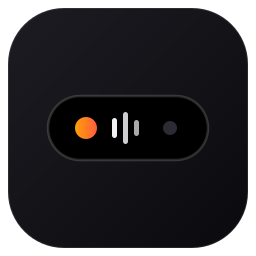
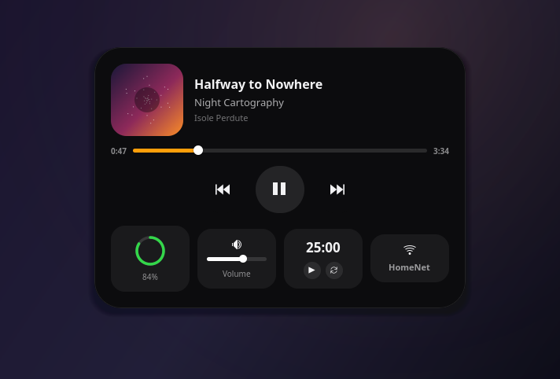
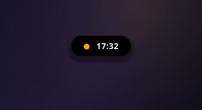
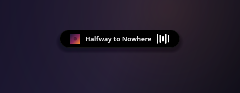
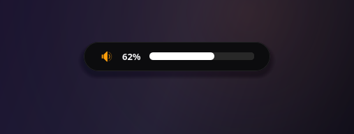
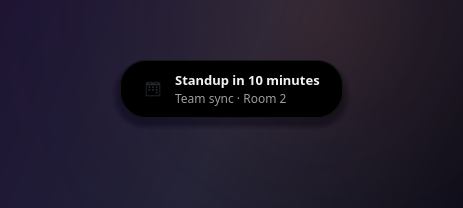
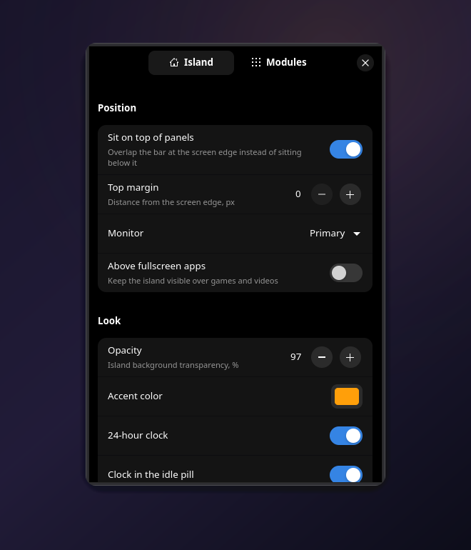

<p align="center">
  
</p>

<h1 align="center">Lost Island</h1>

<p align="center">
  <b>A Dynamic Island for your desktop.</b><br>
  Fluid, native, and light on your battery.
</p>

<p align="center">
  <a href="https://github.com/MarcoZorn/lost-island/actions/workflows/build.yml"></a>
  
  
  
</p>

<p align="center">
  
</p>

A little black island lives at the top of your screen — on your bar, not
under it. Most of the time it's a quiet pill with the clock. Play some music
and it picks up the track; change the volume and it becomes an OSD; plug in
the charger, connect your earbuds, switch Wi-Fi, or get a notification and it
peeks to tell you — then melts back into a pill. Click it and it blooms into
a full card: album art, seek bar, media controls, quick toggles, battery
ring, volume, weather, a pomodoro timer, and live system stats.

| | |
|:---:|:---:|
|  |  |
| *idle — just the time* | *now playing, with live EQ* |
|  |  |
| *volume OSD peek* | *notification peek* |

## Features

- **Music** — every MPRIS player (Spotify, Firefox, mpv, Elisa, …): album
  art, title/artist/album, seek bar, prev/play/next. The island elects the
  *active* player, so a paused podcast never hides the song you started.
- **Volume OSD** — the pill widens into a level bar the moment you touch
  your volume keys.
- **Battery** — charge ring in the expanded card, peeks on plug/unplug.
- **Notifications** — mirrored passively from the session bus; your normal
  notification daemon keeps working untouched.
- **Network** — connectivity chip and peeks on Wi-Fi/Ethernet changes.
- **Bluetooth** — connected device chip with battery level, peeks on
  connect/disconnect.
- **Weather** — current conditions in the card, fetched only when you open
  it (and at most every 30 minutes).
- **Quick toggles** — mute, mic mute, caffeine (blocks sleep via
  `systemd-inhibit`) and a screenshot shortcut.
- **System stats** — CPU and RAM readout, sampled only while the card is
  open.
- **Pomodoro** — a 25-minute focus timer; while it runs, the countdown rides
  along in the pill.
- **Fluid morphs** — one surface that interpolates between pill, peek and
  card, with hover growth, exactly like the one on the phone.
- **Settings** — every option below lives in a native preferences window
  (the gear in the card, or `lost-island --settings`) and applies instantly.

<p align="center">
  
</p>

## Light on your battery — by architecture

Everything is event-driven over DBus; there is no polling loop anywhere:

- Idle, the process wakes **once per minute** to redraw the clock (and the
  wakeup is aligned to the minute, not drifting).
- The EQ bars animate only while music plays *and* the pill is on screen;
  the seek bar ticks at 1 Hz only while the card is open.
- Volume events come from a sleeping `pactl subscribe` pipe; battery,
  network, media and notifications are pure DBus signals.
- Clicks outside the island cost nothing: the layer surface hugs the island
  exactly, so the compositor never even wakes the app.

Measured on the machine it was built on (Arch, KDE Plasma / Wayland):
**≈0.2 % CPU when idle** and **≈110 MB PSS** (most of it shared GTK pages).

## Install

### Arch Linux

```bash
git clone https://github.com/MarcoZorn/lost-island
cd lost-island/packaging && makepkg -si
```

### Debian / Ubuntu

Grab the `.deb` from [Releases](https://github.com/MarcoZorn/lost-island/releases), or:

```bash
sudo apt install python3-gi gir1.2-gtk-4.0 gir1.2-adw-1 libgtk4-layer-shell0
sudo dpkg -i lost-island_*.deb
```

### Fedora

```bash
sudo dnf install lost-island-*.rpm   # from Releases
```

### Any distro

```bash
curl -fsSL https://raw.githubusercontent.com/MarcoZorn/lost-island/main/packaging/install.sh | sudo bash
```

### Start it

```bash
lost-island                                        # try it
systemctl --user enable --now lost-island.service  # keep it
```

Works natively on Wayland compositors that speak layer-shell: **KDE Plasma,
Hyprland, Sway, river, Wayfire** and friends. On GNOME Wayland (no
layer-shell for apps) it falls back to a plain floating window.

## Windows, macOS, Android

Native companion apps live in this repo — same island, same design language,
built per-platform with zero web runtimes. They cover the core feature set
(clock + media) and are **beta**: CI-built, less battle-tested than the
Linux flagship.

| Platform | Stack | Media source | Get it |
|---|---|---|---|
| Windows 10/11 | WPF (.NET 8) | system media session (SMTC) | `LostIsland.exe` from [Releases](https://github.com/MarcoZorn/lost-island/releases) |
| macOS 13+ | AppKit (Swift) | Spotify / Apple Music | `LostIsland-macos.zip` from [Releases](https://github.com/MarcoZorn/lost-island/releases) |
| Android 8+ | Kotlin | any media session | `app-debug.apk` from [Releases](https://github.com/MarcoZorn/lost-island/releases) |

Build notes for each live in [`windows/`](windows/), [`macos/`](macos/) and
[`android/`](android/).

## Configuration

Everything is editable from the settings window; the JSON at
`~/.config/lost-island/config.json` is the backing store:

| Key | Default | Meaning |
|---|---|---|
| `margin_top` | `0` | px between screen edge and island |
| `overlap_panel` | `true` | sit on top of bars/panels instead of below them |
| `monitor` | `""` | connector name (`DP-1`, `HDMI-A-1`); empty = primary |
| `layer` | `"top"` | `"overlay"` to float above fullscreen apps too |
| `idle_clock` | `true` | show the clock in the idle pill |
| `clock_24h` | `true` | 24-hour clock |
| `pill_battery` | `true` | battery in the pill while charging or below 30% |
| `peek_seconds` | `2.2` | how long peeks stay up |
| `modules` | all on | toggle `music`, `volume_osd`, `battery`, `notifications`, `network`, `bluetooth`, `weather`, `system`, `toggles` |
| `weather_city` | `""` | wttr.in place name; empty = automatic |
| `accent` | `"#ff9f0a"` | accent color |

## CLI

```
lost-island             start (single instance)
lost-island --toggle    expand / collapse a running island
lost-island --settings  open the settings window
lost-island --quit      stop it
```

## Hacking

```bash
git clone https://github.com/MarcoZorn/lost-island && cd lost-island
python -m lostisland                 # run from the tree
python scripts/demo-player.py        # fake MPRIS player to exercise the UI
python -m unittest discover tests    # tests
```

The README screenshots are generated, not hand-cropped — real widgets, real
CSS, rendered headless: `scripts/render-shots.py`.

## License

[MIT](LICENSE) © Marco Zorn
